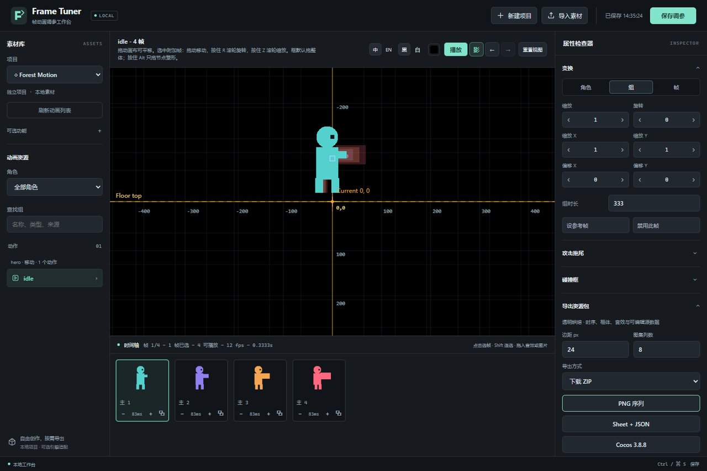

# Frame Tuner

本地帧动画调参工作台：导入 PNG 序列或 Sprite Sheet，在网页里调整变换、帧时长、图层、碰撞框元数据、音效与攻击拖尾，再导出透明序列、Sheet + JSON 或 Cocos Creator 3.8.8 播放包。

默认项目不绑定游戏引擎，也不需要 Agent。需要自动处理时，同一份 skill 可供 Codex、Claude Code、Cursor、DeepSeek Harness 及能读文件、执行命令的其他 Agent 使用。Godot、Unity 和 Codex Pets 保留为可选适配能力。

本仓库基于 [sparklecatta-lang/XSXB-Frame-Tuner](https://github.com/sparklecatta-lang/XSXB-Frame-Tuner) 修改，当前仓库与更新源为 [JinBorn/Frame-Tuner](https://github.com/JinBorn/Frame-Tuner)。



## 启动与使用

安装 Node.js 20+，在仓库目录运行：

```sh
npm install
npm start
```

用浏览器打开 **http://127.0.0.1:5179**。Windows 也可双击 `start_xsxb_frame_tuner.bat`。在工作台创建项目，导入序列帧或带 JSON 的图集，调整后保存并选择导出格式；无需先安装 skill。

双击启动后请保留命令行窗口，它会显示服务日志。退出时先在网页保存，再按 `Ctrl+C` 或关闭该窗口；只关闭浏览器标签页不会停止服务。旧 Lite 启动脚本也采用相同方式。

主工作台在项目选择框下提供“管理项目”：可重命名或确认后从列表移除。移除保留本地素材及调参文件；同名新建会使用新目录，不会自动恢复旧项目。重命名不改变项目 ID、文件路径或未保存编辑。Codex Pets 仍通过“可选功能”开关管理。

图集引用音效时，在导入窗口一起选择配套音频，工作台会恢复帧绑定与音量。缺失或无法区分的同名文件会提示修正。遇到已有同名动作，可取消、更改名称，或明确确认替换；替换会清理该动作依赖旧帧顺序的逐帧调参、框体、挂件、音效和拖尾，保留角色／动作级配置与其他动作。

- 动画预览：播放、逐帧检查、参考帧、透明背景与网格。
- 三层变换：角色、动作组、单帧的缩放、偏移和旋转。
- 精确输入：直接输入变换数值，Enter 或移开焦点应用，Esc 取消；上下箭头微调，Shift 加速，支持撤销。
- 画布变换：在预览工具中选择“移动／缩放／旋转”后拖动，缩放和旋转使用左右拖动；沿用属性区选择的角色／动作／单帧范围。中键平移视图，“浏览”模式保留原有框体与挂件操作。
- 时间轴：保留不等帧时长、组级时长和禁用帧。
- 图层与效果：图片挂件、逐帧音效和可编辑攻击拖尾。
- 框体：编辑 hitbox、hurtbox、collisionbox 元数据，导出后由游戏决定如何使用。
- 统一透明画布：在导出时按可见内容计算，同一角色切换动作保持一致原点。

Web 编辑器运行在本机。CLI 导出复用相同的画面合成器，需已安装 Chrome、Edge 或 Chromium；`npm install` 安装 `playwright-core`，不会自动下载一套浏览器。

## 导出与引擎支持

| 目标 | 产物与用途 |
|---|---|
| 通用 PNG 序列 | 透明帧图、时长与事件元数据，可供其他引擎自行读取 |
| 通用 Sheet + JSON | 合并图集及帧描述，适用于帧动画素材管线 |
| Cocos Creator 3.8.8 | 便携素材、manifest 和 TypeScript 播放组件 |
| 现有 Godot 项目 | 保留 SpriteFrames 导入与已有 runtime 同步 |
| 现有 Unity 项目 | 保留资源复制、数据库导入和播放组件 |

导出保留当前编辑效果；图层、变换和插入的拖尾烘焙到透明帧中。帧时长、源帧映射、音效事件和支持的框体数据随元数据保存。通用格式为其他引擎提供接入边界，并不宣称已经为所有引擎实现原生适配。

Cocos 包包含 `assets/resources/frame-tuner/<项目ID>/` 下的素材与 manifest，以及 `assets/scripts/frame-tuner/` 下的 `FrameTunerPlayer`、数据类型和播放时钟。把生成的 `assets` 合入指定项目，在 Canvas 下的节点添加播放器，加载 manifest 后播放指定动作。支持循环/单次、暂停/继续、不等时长、禁用帧、朝向翻转、音效事件和框体查询。框体不会自动变成物理碰撞器，导出不会改写游戏业务代码。详见 [Cocos 3.8.8 接入](docs/cocos-3.8.8.md)。

## 命令行与 Agent

```sh
node tools/frame_tuner.js create --name "Hero" --id hero
node tools/frame_tuner.js import --project hero --input "D:/Art/Hero/idle" --profile hero --animation idle --fps 12
node tools/frame_tuner.js validate --project hero
node tools/frame_tuner.js export --project hero --format sheet --out "D:/Exports/HeroSheet"
node tools/frame_tuner.js export --project hero --format cocos --out "D:/Exports/HeroCocos"
```

Sheet 导入使用 `--input <图集.png> --json <图集.json>`。导出支持 `--format sequence|sheet|cocos`，使用 `--zip --out <文件.zip>` 可打包 ZIP。自动发现浏览器失败时指定 `--browser <可执行文件>`，或设置 `FRAME_TUNER_BROWSER`。

命令返回 JSON，失败使用非零退出码。导入与验证无需浏览器；图片导出使用无头浏览器，不要求点击网页或操作系统目录选择器。`node tools/frame_tuner.js --help` 可查看完整参数。

安装 skill 需显式选择目标，例如安装到一个游戏项目供 DeepSeek Harness 使用：

```sh
node tools/install_skill.js --client deepseek-harness --project-root "D:/Games/MyGame"
```

`--client` 还支持 `codex`、`claude-code`、`cursor`；其他配置使用 `--target <完整skill目录>`。默认项目级，用户级需 `--scope user`。安装器不覆盖已有非托管目录或手工修改的指令。四种客户端的路径、安装/升级和调用方式见 [Agent 接入](docs/agents.md)。

## 已有项目与可选功能

新项目使用主工作台的中立存储。已有 Godot/Unity 绑定保留原来的游戏根目录与数据，同步仅作用于被明确绑定的引擎项目。Godot 校验工具为 `tools/validate_import.js`，Unity 为 `tools/validate_unity.js`；只有需要完整 gameplay 验证时才使用对应的严格游戏接线检查。

旧版 Lite 仍使用独立的项目列表与目录，可通过 `npm run start:lite` 或 `start_xsxb_frame_tuner_lite.bat` 打开 **http://127.0.0.1:5180**。它不会自动迁移或覆盖主工作台项目。

Codex Pets 默认不扫描。在左侧“可选功能”中明确启用后才能发现本机宠物；兼容 v1/v2 WebP 图集，自定义宠物回写保留原图备份，内置宠物只读。启动时也可设置 `FRAME_TUNER_CODEX_PETS=1`。这只是可选素材适配器，工作台和其他 Agent 不依赖 Codex 应用。

## 本地数据与更新

默认本地项目数据：

```text
data/projects.json
data/projects/<项目ID>/
workspace/projects/<项目ID>/
```

旧 Lite 数据仍在 `data/lite/` 与 `workspace/lite/`。这些运行数据由 Git 忽略；源素材与导出结果留在本机。需要隔离不同工作台实例或自动化任务时，可设置 `FRAME_TUNER_ROOT` 为独立的数据根目录。

备份前保存并停止服务，完整保留数据根下的 `data/`、`workspace/` 和存在时的 `audio/`，恢复到新的空目录。具体步骤、旧 Lite 入口和外部路径限制见[备份与恢复](docs/backup-and-restore.md)。

更新器只接受 `JinBorn/Frame-Tuner` 的 `main` 分支，并保留工作区干净、仅快进更新的保护；有本地代码修改或分支分叉时不自动覆盖。工作台更新与 skill 安装分开，更新网页不会写入 `.codex`、`.agents`、`.claude`、`.cursor` 或 `.dsh` 的个人配置。Skill 升级需再次运行安装器并明确指定 `--replace`。

## 维护验证

参考帧开启后，按住 **H** 临时隐藏，松开恢复；焦点在参考帧复选框或数值框时也可使用，文字输入框中仍正常输入。如果参考帧与当前帧完全重合，隐藏前后可能看不出区别。

通用项目的时间轴帧号右侧提供复制与垃圾桶图标，点击垃圾桶即可删除该帧。确认后立即保存并同步调整后续帧的数据索引，不支持撤销；原始图片、音效文件保留，动作至少保留一帧。

画布工具栏提供“平滑预览 / 像素预览”两个按钮。像素预览关闭主帧和图片挂件的插值，适合检查像素画；此设置仅影响本机预览，导出仍使用平滑采样。放大不会增加源图细节，非整数缩放或旋转也可能产生锯齿。

```sh
npm run check
npm test
npm run test:browser
npm run typecheck:cocos
```

`npm test` 包含真实浏览器的导出与切换竞态回归，需要本机 Chrome、Edge 或 Chromium。`typecheck:cocos` 需要安装 Creator 3.8.8。Windows 上的浏览器闭环、Creator 实际构建与播放结果见 [验收记录](docs/verification-2026-10-06.md)。

安装器测试仅操作临时目录。Agent 客户端目录依据官方文档验证，未向模型 API 发起请求，也没有声称所有客户端的自主执行行为已实测。Cocos 的包检查、类型检查与 Creator 运行验证范围见 [Cocos 接入文档](docs/cocos-3.8.8.md)。

## License

MIT
